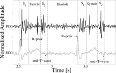

# time series imputation model 성능 비교 실험

## Intorduction

해당 Git의 내용은 2024년 1학기 응용데이터베이스특론 강의에서의 Report 과제로 사용된 내용입니다.

관련 내용으로는 각 time series imputation 모델 간의 성능 비교입니다.

## 데이터셋
### PhysioNet 2012 Mortality Prediction Challenge (PhysioNet-2012)
imputation 모델에서 자주 사용하는 helth care 데이터로 정보는 아래의 링크에 있습니다.
https://physionet.org/content/challenge-2012/1.0.0/



## Model 설명
모델은 총 4개로 구성되어 있으며 관련 정보가 있는 링크는 아래와 같습니다.

* SAITS (https://github.com/WenjieDu/SAITS)
* CSDI (https://github.com/ermongroup/CSDI)
* BRITS (https://github.com/caow13/BRITS)
* iTransformer (https://github.com/thuml/iTransformer)

## 성능 지표
성능 지표로 MAE, RMSE, MRE를 사용했습니다.

```
@article{du2023saits,
    title={{SAITS: Self-Attention-based Imputation for Time Series}},
    journal={Expert Systems with Applications},
    volume={219},
    pages={119619},
    year={2023},
    issn={0957-4174},
    doi={10.1016/j.eswa.2023.119619},
    url={https://arxiv.org/abs/2202.08516},
    author={Wenjie Du and David Cote and Yan Liu},
}
@inproceedings{tashiro2021csdi,
  title={CSDI: Conditional Score-based Diffusion Models for Probabilistic Time Series Imputation},
  author={Tashiro, Yusuke and Song, Jiaming and Song, Yang and Ermon, Stefano},
  booktitle={Advances in Neural Information Processing Systems},
  year={2021}
}
@inproceedings{
  title={BRITS: Bidirectional Recurrent Imputation for Time Series},
  author={Wei Cao, Dong Wang, Jian Li, Hao Zhou, Lei Li Yitan Li.},
  booktitle={NerIPS},
  year={2018}
}
@article{liu2023itransformer,
  title={iTransformer: Inverted Transformers Are Effective for Time Series Forecasting},
  author={Liu, Yong and Hu, Tengge and Zhang, Haoran and Wu, Haixu and Wang, Shiyu and Ma, Lintao and Long, Mingsheng},
  journal={arXiv preprint arXiv:2310.06625},
  year={2023}
}
```
